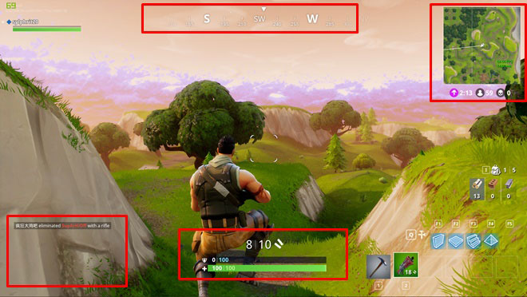
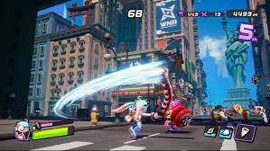
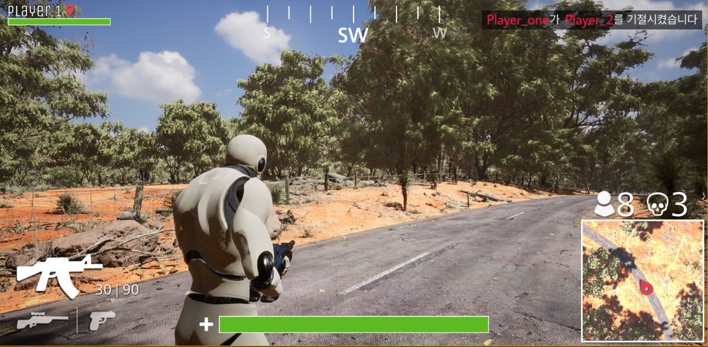
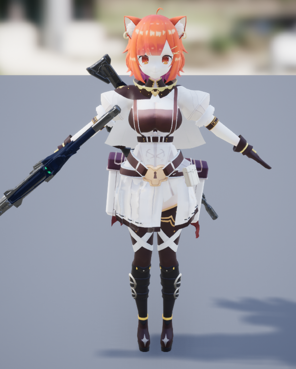
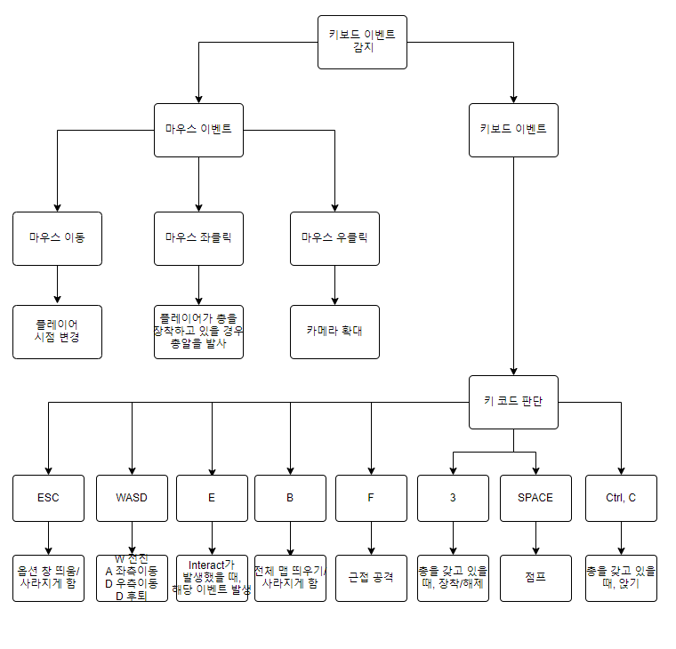
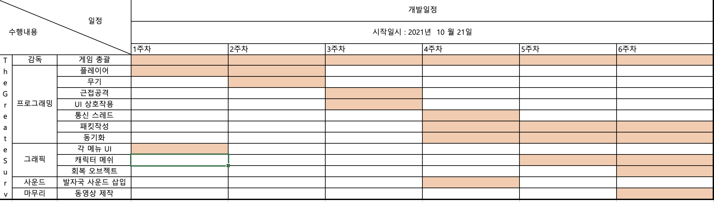

# 프로젝트명: The Great Survive

# 목차
1. [컨셉](#컨셉)
2. [관련 이미지와 동영상](#관련-이미지와-동영상)
3. [대표 이미지](#대표-이미지)
4. [컨셉과 대표 이미지 기반 작품묘사](#컨셉과-대표이미지-기반-작품묘사)
5. [The Great Survive의 구성요소](#the-great-survive-구성-요소)
6. [게임 시스템 디자인](#게임-시스템-디자인)
7. [요구사항(6주차)](#요구사항6주차)
8. [요구사항(1년차)](#요구사항1년차)
9. [키보드이벤트 흐름도](#키보드이벤트-흐름도)
10. [개발 작업](#개발-작업)

# [컨셉]

## 메인컨셉 :

- 경쟁 - 

### 서브 컨셉 1 :

- 그래픽 - 유저가 리얼하게 체험할 수 있도록 높은 퀄리티의 3D 모델을 사용

### 서브 컨셉 2 :

- 선택 - 무기와 시작 장소 등을 자신이 선택하여 진행

### 서브 컨셉 3 :

- 성장 - 상대를 쓰러트리면 강해짐

### 서브 컨셉 4 :

- 전략 - 다양한 Action Binding을 통해 전투에 있어 다양성을 제공

### 서브 컨셉 5 :

- 멀티플레이 - 다른 유저들과 실시간으로 통신하며 메인컨셉을 뒷받침

  

# [관련 이미지와 동영상]
<!-- 
- 이미지  
  
- 동영상
   -->
  
  

  

# [대표 이미지]

  

# [컨셉과 대표이미지 기반 작품묘사]

> ### 대표이미지 기반 :
>
게임의 흐름은 로그인->로비->매칭->인게임 순으로 진행됩니다.
로그인기능은 현재 게임main서버에 있지만, 유저수에 따라 서버를 분산해야 할 경우, HTTP로 처리할 수 있도록 만들 예정입니다.
로비와 인게임은 각각의 세션이 존재하며, 인게임 세션은 로비의 세션을 상속받은 공유포인터값입니다.
인게임에서는 메인 컨셉인 경쟁을 살려, 남은 인원들과 자신의 킬 수 등이 UI로 보여지게 됩니다.
이어서 메인에는 나와있지 않지만,
매칭이 완료되면 여러 군데의 시작 지점중 자신이 시작하고 싶은 위치를 고르고,
기존 배틀로얄에서 쓰이지 않는 키들을 액션에 바인딩하여 액션의 비중을 높일 예정입니다.
또한, 상대방을 킬하게 되면 UI로 표시되며, 상대방이 갖고있던 아이템을 얻을 수 있습니다.

> ### 컨셉 기반:
> 
1. 배틀로얄 장르
배틀로얄 장르의 기본적인 시스템을 채용.
체력바, 미니맵, 오픈월드와 같은 기본적인 시스템을 채용.
UI의 경우도 위와 비슷하게 책정할 예정입니다.
2. 액션 요소
일반적인 Shooting기반의 배틀로얄과 달리 제한된 개인 자원을 통해
액션의 중요도를 높임
  

# [The Great Survive 구성 요소]

- 다른 플레이어들과의 경쟁(교전)을 통해 마지막까지 살아남는 3D TPS배틀로얄게임.

 

## 1. 메커니즘

[도전 과제]

1. 마지막까지 살아남는다.
2. 다른 플레이어들과 경쟁하며 살아남는다.
3. 맵에서 자원을 수집하고, 활용한다.

[재미 요소]

1. 교전(소규모 경쟁)에서 승리할 때마다 보상을 얻는다.
2. 무기의 종류가 다양하여 자신이 원하는 무기를 선택할 수 있다.
3. 시작과 동시에 제한적인 자원과 빠르게 줄어드는 맵 크기를 통해 빠른 템포의 교전 지향적이게 만들어 지루함을 줄인다.
4. 게임시작 직전까지 미니맵에서 자신이 시작할 위치를 선택할 수 있게 하여, 시작전부터 전략을 생각하도록 한다.

 

## 2. 이야기

[만들게 된 배경]  
Stateful서버와 Stateless서버를 모두 학습하면서,
주로 실시간 게임쪽에 쓰이는 Stateful서버를 사용해 게임을 만들어보고 싶었습니다.
개발에 앞서 서버 최적화를 최우선적으로 생각하였고, 이를 위하여
C++을 사용하고ㅗ 최적화가 눈에 가장 잘 보이는 멀티 슈팅게임을 제작하게 되었습니다.
멀티 슈팅게임 중에서도 최근 유행하고 평소 즐겨하는 장르인 배틀로얄 장르를 기초부터 제작하게 되었습니다.

[카메라 관점]  
카메라 관점은 Main Viewport에서는 3인칭 관점으로 진행합니다.
플레이어의 회전에 따라 카메라도 함께 회전하기 때문에 카메라는 플레이어의 등만 비춥니다.
또한, 총을 쏠 때마다 반동을 주어 카메라가 흔들리게 만들고 앉거나 뛸 때 카메라가 부드럽게 움직이도록 약간의 카메라 렉을 추가합니다.

 

## 3. 미적요소

[디자인]  
디자인은 3D모델과 UI디자인으로 나뉩니다.
3D 모델에는 캐릭터, 배경, 자원 오브젝트들이 존재하며
캐릭터와 배경은 각각 하나씩, 자원 오브젝트들은 무기, 회복자원 등이 존재합니다.
캐릭터는 일반적인 사람의 체형을 가진 모델을 사용할 계획입니다.
배경은 오픈월드인만큼 커다란 맵을 사용하며, 해외의 시골을 배경으로 합니다.
UI디자인은 로그인, 로비, 인게임UI로 나뉩니다.
로그인 UI는 Input Component와 Button이 존재하며
로비 UI는 캐릭터 모델과 배경 이미지, 매칭시작/매칭 취소 버튼이 존재합니다.
인게임 UI는 미니맵, 체력표시, 게임로그, 남은인원, 킬수, 소유 무기, 자신의 정보, 현재 바라보는 방향을 나타내는 UI가 존재합니다.

[컬러]
맵의 기본적인 컬러를 담당하는 라이팅은 스카이 라이트를 통해 구현할 예정입니다.
그러나, 여유가 된다면 시간의 흐름에 따라 달라지는 라이팅을 구현할 예정입니다.

[음향]  
음향은 배경의 기본 Bgm과 플레이어의 사격음이 전부입니다.
Bgm은 평활운 느낌으로 나무가 흔들리는 소리나 새가 지저귀는 소리를 사용할 예정입니다.
 

## 4. 기술
언리얼 엔진과 직접 제작한 C++서버를 통해 개발합니다.
네트워크 통신은 부분RUDP로 구현하며, 반드시 데이터를 받아야 하는
게임시작 패킷, 로그인 확인 패킷 등만 RUDP로 구현하고 나머지는 일반적인 UDP로 구현하였습니다.
또한, 순수 C/S구조를 사용하여 서버에 부하가 있을 수 있지만 유저 플레이 환경을 쾌적하도록 개발했습니다.

# [게임 시스템 디자인]
## 1. 게임 오브젝트 분해

|연번|오브젝트 이름|오브젝트 이미지|
|---|---|---|
|1|플레이어||
|2|무기||
|3|회복 오브젝트||
|4|자기장||

## 2. 파라미터
### 1) 오브젝트 이름: SCharacter

|속성|영문명칭|설명|
|---|---|---|
|UCameraComponent|CameraComp|플레이어에 부착된 카메라 컴포넌트|
|USpringArmComponent|SpringArmComp|플레이어에 부착된 스프링암 컴포넌트|
|bool|bDied|플레이어가 죽었는지 체크|
|TSubclassOf<UUserWidget>|GameUI|인게임 UI 객체|
|bool|bWantsToZoom|총기를 들고 있을 시, 줌(확대)를 할 것인지 체크|
|bool|isInteract|플레이어가 맵의 오브젝트와 Interact를 했는지 체크|
|float|ZoomFOV|줌을 할때랑 줌을 풀 때 바뀌는 FOV값|
|float|DefaultFOV|줌을 안할 때의 평소 FOV값|
|bool|isJump|플레이어가 점프를 했는지 체크, 점프 가능할 때 1프레임만 true상태가 됨|
|bool|CurrentCrouch|플레이어가 Crouch를 한 상태인지 체크|
|bool|isCrouch|CurrentCrouch와 같은지 체크, 같지 않다면 Move패킷을 보내고 CurrentCrouch값을 복사할당|
|ASWeapon|CurrentWeapon|현재 플레이어가 들고 있는 무기|
|ASWeapon|DetectedWeapon|플레이어가 매 프레임 Raycast를 쏘며 발견한 무기|
|float|CurrentMFV|플레이어의 MoveFront값, 입력에 따라 변함(PlayerInputComponent)|
|float|CurrentMRV|플레이어의 MoveRight값, 입력에 따라 변함(PlayerInputComponent)|
|float|MFV|CurrentMFV와 같은지 체크, 같지 않다면 Move패킷을 보내고 CurrentMFV값을 복사할당|
|float|MRV|CurrentMRV와 같은지 체크, 같지 않다면 Move패킷을 보내고 CurrentMRV값을 복사할당|
|float|TurnSpeed|플레이어가 회전하고 있는 방향을 나타냄.(-1, 0, 1)|
|float|TurnSpeedLast|TurnSpeed와 같은지 체크, 같지 않다면 Move패킷을 보내고 TurnSpeed값을 복사할당|
|bool|hasGun|플레이어가 총을 갖고 있는지 체크|
|FName|WeaponAttachSocketName|SocketName 플레이어 Mesh에 총을 붙일 위치의 이름|
|float|HealthAmount|플레이어 체력|
|int|CurrentCombo|현재 캐릭터의 근접공격 콤보 단계|
|int|MaxCombo|캐릭터의 최대 근접공격 콤보|
|int|Bullet|캐릭터의 총알개수|
|UAnimMontage*|HitReactMontage|공격받았을 때 재생할 애니메이션 몽타주|
|TSubclassOf<UCameraShakeBase>|MeleeCamShake|근접 공격을 했을 때 카메라를 흔들 객체|
|ClientSocket|Socket|소켓 클래스의 싱글턴 객체|
  
### 2) 오브젝트 이름: PlayerPawn : SCharacter(Extends)
  
|속성|영문명칭|설명|
|------|---|---|
|CollisionSylinder|CapsuleComponent|충돌을 담당하는 Capsule모양의 컴포넌트. RootComponent로 설정|
|Arrow|ArrowComponent|오브젝트가 바라보는 방향|
|CharacterMesh0|Mesh|캐릭터의 Mesh를 설정|
|SpringArmComp|Spring ArmComp|캐릭터의 Spring Arm 컴포넌트|
|CameraComp|Camera Comp|캐릭터에 빙의했을 때 플레이어가 보게 될 기준 카메라|
  
### 3) 오브젝트 이름: LoginWidget / WBP_Login
  
|속성|영문명칭|설명|
|------|---|---|
|ClientSocket|Socket|소켓 클래스의 싱글턴 객체|
|UEditableTextBox|Email|이메일 Input Component(WBP_Login에 바인딩)|
|UEditableTextBox|Password|패스워드 Input Component(이하 동일)|
|UButton|LoginButton|로그인 버튼|
|UButton|RegisterButton|회원가입 버튼|
|UEditableTextBox|NotifyUI|로그인, 회원가입 에러시 보여지게 될 알림텍스트|
|UWidgetAnimation|Notification_Anim|NotifyUI의 애니메이션|
|UEditableTextBox|Nickname|회원가입 시 닉네임 Input Component|
  
### 4) 오브젝트 이름: InGameWidget / WBP_Crosshair
  
|속성|영문명칭|설명|
|------|---|---|
|UEditableTextBox*|Interact|Interaction이 발생했을 때 생길 텍스트박스|
|UWidgetAnimation*|Notify_Interact|Interact의 애니메이션|
|UProgressBar*|ProgressBar_HP|HP바|
|UImage*|GameOver|게임오버를 나타내는 이미지|
|UWidgetAnimation*|GameOverAnim|게임오버 이미지를 나타내는 애니메이션|
|UImage*|Victory|승리를 나타내는 이미지|
|UWidgetAnimation*|VictoryAnim|승리 이미지를 나타내는 애니메이션|
|UTextBlock*|PersonText|현재 게임의 남은 인원수를 나타내는 텍스트|
|UTextBlock*|KillText|자신의 캐릭터가 킬한 인원수를 나타내는 텍스트|
|UTextBlock*|RingTime|현재 자기장이 줄어들 때까지의 시간을 나타내는 텍스트|
|UVerticalBox*|VerticalBox_0|킬로그를 나타낼 VerticalBox|
|UTextBlock*|BulletText|현재 총알수를 나타내는 텍스트|
  
### 5) 오브젝트 이름: SWeapon
  
|속성|영문명칭|설명|
|------|---|---|
|USkeletalMeshComponent|MeshComp|SWeapon에 부착될 Mesh 컴포넌트|
|TSubclassOf<UDamageType>|DamageType|데미지 타입. UE4에서 미리 정의되어있음|
|FName|MuzzleSocketName|총알이 발사되는 지점의 소켓이름|
|UParticleSystem|MuzzleEffect|총구에서 생성되는 총알 발사 이펙트|
|UParticleSystem|DefaultImpactEffect|총알이 플레이어를 제외한 오브젝트에 부딪혔을 때 재생될 이펙트|
|UParticleSystem|FleshImpactEffect|총알이 플레이어의 머리에 충돌했을 때 재생 될 이펙트|
|UParticleSystem|TracerEffect|총알이 나가는 궤적을 그리는 이펙트|
|TSubclassOf<UCameraShakeBase>|FireCamShake|총알을 발사할 때 Shake를 줄 Shake객체(BP에서 설정이므로 명시적 선언)|
|float|BaseDamage|무기의 기본데미지|
|FTimerHandle|TimerHandle_TimeBetweenShots|연사를 할 때 일정 간격을 두도록 설정하는 Timer의 핸들|
|float|LastFireTime|마지막으로 총알을 발사한 시간|
|float|RateOfFire|연사에서 총알이 발사될 비율|
|float|TimeBetweenShots|60 / RateOfFire의 값|
  
### 6) 오브젝트 이름: ClientSocket
  
|속성|영문명칭|설명|
|------|---|---|
|FRunnableThread|Thread|GameThread와 별개로 실행할 Thread객체|
|FThreadSafeCounter|StopTaskCounter|Thread가 안전하게 종료될 수 있게 관리하는 객체|
|bool|isLoginError|로그인에러 체크|
|bool|isMatching|매칭이 되어 게임이 시작되었는지 체크|
|bool|isStart|게임이 시작되었는지 체크|
|std::string|Nickname|플레이어의 닉네임|
|std::queue<const Message*>|MessageQueue|Flatbuffer를 통해 받은 패킷을 GameThread에서 사용할 수 있도록 관리하는 큐|
|std::mutex|QueueMutex|MessageQueue를 Thread-Safe하게 사용하기 위한 Mutex객체|
|TArray<TSharedPtr<sCharacter>>|players|player의 정보를 담고 있는 구조체인 sCharacter(Unreal Object가 아닌 커스텀 구조체)의 배열|
|TArray<TSharedPtr<Gun>>|Guns|Gun의 정보를 담고 있는 구조체의 배열|
|char[]|mReadBuffer|수신버퍼|
|char[]|mWriteBuffer|송신버퍼|
|SOCKET|mSocket|윈도우 Socket객체|
|SOCKADDR_IN|mServerInfo|송/수신을 받을 서버의 정보객체|
|WSADATA|mWsaData|소켓 통신에 필요한 WSADATA구조체 객체|
|int32|mPacketNumber|패킷의 번호|
  
### 7) 오브젝트 이름: BPlayerController/BP_PlayerController
  
|속성|영문명칭|설명|
|------|---|---|
|TSubclassOf<ACharacter>|WhoToSpawn|게임 시작할 때 생성할 다른 플레이어들의 클래스객체(BP로 확장 후 BP에서 설정)|
|TSubclassOf<ASWeapon>|GunSpawn|게임 시작할 때 생성할 무기의 클래스객체(위와 같음)|
|FName|LevelName|현재의 레벨이름|
|ASCharacter|SpawnedCharacter|생성된 자신 캐릭터의 정보|
|FTimerHandle|Timer|세션연장 패킷을 보낼 타이머의 핸들|
|TArray<ASCharacter*>|Characters|게임의 모든 플레이어들(Room안의)을 관리하는 배열|
|TArray<ASWeapon*>|Guns|게임의 모든 총들을 관리하는 배열|
|ASWeapon|TargetGun|다른 유저가 총을 획득했을 때 대상이 되는 총의 정보|
|ASCharacter*|removeCharacter|소켓과 관련하여 지울 대상이 될 캐릭터를 나타내는 객체|
|TSubclassOf<UUserWidget>|loadingWidget|로딩 위젯 선택|
|ULoadingWidget*|loading|로딩 위젯|
|TArray<FVector>|RoundVector|각 라운드에 해당하는 원의 중심점|
|FVector|NowRound|현재 라운드에 해당하는 원의 중심점|
|int|RoundNum|현재 라운드|
|ClientSocket|Socket|클라이언트 소켓의 싱글턴 객체|
  
## 3. 행동
### 1) 오브젝트 이름: SCharacter/PlayerPawn
  
|행동|설명|
|------|---|
|MoveForward()|플레이어가 바라보는 방향으로 앞/뒤로 움직임|
|MoveRight()|플레이어가 바라보는 방향에서 좌/우로 움직임|
|RotateYaw()|카메라의 Yaw회전|
|RotatePitch()|카메라의 Pitch회전|
|BeginCrouch()|플레이어 앉기|
|EndCrouch()|Crouch해제(다시 서기)|
|BeginZoom()|총을 들고 있을 시, 오른쪽 마우스 입력을 받아 카메라 줌|
|EndZoom()|줌 해제|
|JumpFunc()|플레이어 점프|
|StartFire()|총을 들고 있을 시, 발사|
|StopFire()|발사 중일 시, 멈춤|
|CheckMove()|플레이어가 움직였는지 체크(서버로 보낼 목적)|
|Interact()|맵에 설치된 오브젝트들과 인터렉션|
|SearchObjects()|맵에 설치된 오브젝트들과 인터렉션하는지 여부를 탐색|
|OtherPlayerMove()|다른 플레이어가 움직였을 때 이를 반영|
|SetUIMine()|컨트롤 중인 캐릭터의 UI를 메인으로 설정|
|SetHPUI()|HP가 변했을 때 이를 UI에 반영|
|SetDie()|플레이어가 죽었을 때 이를 처리|
|SetGameOver()|게임오버를 설정|
|SetVictory()|게임 승리를 설정|
|SetGameInfoUI()|킬이 발생했을 때 이를 UI에 반영|
|Attack()|근접공격을 수행|
|PlayAttack()|근접공격 애니메이션을 실행|
|AddSlot()|킬로그를 UI에 표시|
|SetChild()|킬로그 VerticalBox를 메인 UI에 부착|
|Equip()|무기를 장착/해제|
|SetBullet()|남은 총알 개수를 UI에 반영|
|SetZoneDamage()|플레이어가 자기장에 의해 데미지를 받음|
|Action()|플레이어가 액션으로 상대방을 공격|

### 2) 오브젝트 이름: LoginWidget / WBP_Login
  
|행동|설명|
|------|---|
|OnClickedLogin()|로그인 버튼을 눌렀을 때 발생하는 이벤트|
|LoginError()|로그인 에러가 발생했을 때 발생하는 이벤트|
  
### 3) 오브젝트 이름: InGameWidget/WBP_Crosshair
  
|행동|설명|
|------|---|
|ShowInteractText()|인터렉션 가능한 상황에 텍스트를 보여줌|
|ShowGameOver()|게임오버 이미지를 띄움|
|ShowVictory()|승리 이미지를 띄움|
|SetPersonCount()|남은 인원수의 텍스트를 바꿈|
|SetKillCount()|자신이 킬한 수의 텍스트를 바꿈|
|SetBulletValue()|자신의 총알 수의 텍스트를 바꿈|
|CallDeleFunc_SetRoundTime()|PlayerController부터 델리게이트를 받아 자기장 시간을 설정|
  
### 4) 오브젝트 이름: SWeapon
  
|행동|설명|
|------|---|
|PlayFireEffects()|발사 이펙트를 재생|
|Fire()|발사하는 함수|
|StartFire()|발사 시작하는 함수(연발)|
|StopFire()|발사 중지하는 함수(연발)|
  
### 5) 오브젝트 이름: ClientSocket
  
|행동|설명|
|------|---|
|ClientSocket()|생성자|
|Init()|소켓 생성자|
|Run()|RecvFrom을 새 쓰레드에서 실행|
|Stop()|쓰레드 멈춤|
|Exit()|쓰레드 탈출|
|StartListen()|쓰레드 생성|
|StopListen()|쓰레드 파괴|
|GetSingleton()|해당 클래스에 대한 싱글턴 객체 반환|
|Begin()|소켓 초기설정|
|Bind()|소켓 바인딩|
|RecvFrom()|패킷을 받음|
|WriteTo()|패킷을 보냄|
|CloseSocket()|소켓을 닫음|
|GetSocket|소켓이 있는지 확인|
|ResetTimeSession()|세션연장 패킷을 보냄|
|WRITE_PU_C2S_REQUEST_LOGIN()|로그인 요청을 보내는 패킷을 만듬|
|WRITE_PU_C2S_START_MATCHING()|게임 매칭 요청을 보내는 패킷을 만듬|
|WRITE_PU_C2S_CANCEL_MATCHING()|게임 매칭 취소 요청을 보내는 패킷을 만듬|
|WRITE_PU_C2S_EXTEND_SESSION()|세션 연장 패킷을 만듬|
|WRITE_PU_C2S_MOVE()|플레이어가 움직일 때 움직임 패킷을 만듬|
|WRITE_PU_C2S_PICKUP_GUN|플레이어가 총을 집었을 때의 패킷을 만듬|
|WRITE_PU_C2S_SHOOT|플레이어가 총을 발사했을 때의 패킷을 만듬|
|WRITE_PU_C2S_MELEE_ATTACK|플레이어가 근접공격을 했을 때의 패킷을 만듬|
|WRITE_PU_C2S_EQUIP_GUN|플레이어가 총을 장착/해제 했을 때의 패킷을 만듬|
|WRITE_PU_CHANGE_GUN|플레이어가 총을 변경했을 때의 패킷을 만듬|
|WRITE_PU_SET_USER_POSITION|플레이어가 게임을 처음 시작할 위치를 골랐을 때의 패킷을 만듬|
|WRITE_PU_C2S_ZONE_DAMAGE|플레이어가 자기장에 의해 데미지를 받았을 때의 패킷을 만듬|

### 6) 오브젝트 이름: BPlayerController / BP_PlayerController
  
|행동|설명|
|------|---|
|SetPlayers()|플레이어들을 레벨에 배치|
|ResetSessionTime()|세션 연장 함수|
|GetPacket()|패킷을 ClientSocket에서 받아옴|
|GameStart()|게임 시작할 때 발생하는 함수|
|SpawnMap()|로그인에 성공하여 로비창을 띄움|
|SpawnGame()|매칭에 성공하여 게임창을 띄움|
|CancelLoading()|로딩 창을 지움|
|SetMyPos()|자신의 시작위치를 정함|

## 4. 상태
### 1) 오브젝트 이름: SCharacter
  
|현상태|전이상태|전이조건|
|------|---|---|
|Idle|Jump|Space Bar|
|Idle|Jog|Speed > 10|
|Idle|Crouch|Ctrl|
|Idle|Zoom|Mouse Right|
|Idle|Shoot|Mouse Left|
|Idle|Run Jump|Space Bar & Speed > 10|
|Idle|hasGun|Get Gun|
|Idle|EquipGun|Equip Gun|

## 5. 게임의 규칙
### 1) 핵심 규칙
1. 다른 플레이어의 총알에 맞거나 액션에 맞으면 체력이 닳음.
2. 체력이 0이하가 되면 죽음.
3. 살아남은 사람이 나 혼자가 되면 승리.
  
### 2) 보조 규칙
1. 맵에 있을 수 있는 크기가 점점 좁아짐
2. 회복 오브젝트와의 Interaction을 통해 체력을 회복할 수 있음.
3. 죽게 되면 로비로 즉시 나갈 수 있음.

## 6. 게임에서 사용될 공식
1. 총 발 당 발사 딜레이 – 0.5초
2. 총 데미지 – 머리 명중 데미지 = 일반 데미지 * 2.5
3. 총알 유효범위 – 1000m
4. 이동속도 – 기본 이동속도 1.0, 앉아서 이동시 0.5

# [요구사항(6주차)]
### 그래픽
4. 로그인 화면, 회원가입 화면, 로비 화면, 인게임 화면 총 4개의 화면이 있다.
5. 로그인 화면에는 이메일과 패스워드를 입력할 수 있는 Input Component와 로그인을 수행하는 버튼, 회원가입 페이지로 넘어가는 버튼이 있다.
6. 회원가입 화면에는 이메일과 패스워드, 닉네임을 입력할 수 있는 Input Component와 회원가입을 수행하는 버튼, 로그인 페이지로 넘어가는 버튼이 있다.
7. 로비 화면에는 매칭을 시작하는 Matching Start버튼이 있다.
  
### 프로그래밍
1. 게임을 시작하면 화면 왼쪽 하단에 자신의 캐릭터의 등이 보인다.(3인칭)
2. 플레이어는 WASD로 이동하며, 마우스로 시점을 회전할 수 있다.
3. 이동 또는 시점회전을 해도 화면상에서는 플레이어는 그대로 보이고 맵이 움직이는 것처럼 보인다.
4. 화면 정가운데에는 작은 원모양의 조준점이 있다.
5. 무기와 회복 오브젝트들은 땅에 떨어져있으며 조준점과 오브젝트가 일치하면 조준점에서 살짝 오른쪽에 어떤 키를 누르라고 안내가 나온다.
6. 조준점과 오브젝트가 일치해있을 때, 해당 키를 누르게되면 즉시 반응이 일어난다.
7. 무기 오브젝트의 경우엔 장착을 하게 된다.
8. 무기를 장착하게 되면 무기를 소유한 상태&장착한 상태가 된다.
9. 무기를 장착한 상태에서는 앉기(컨트롤키)를 사용할 수 있게 된다.
10. 무기를 장착한 상태에서는 무기를 장착하지 않은 상태와 다른 애니메이션이 적용된다.
11. 무기를 장착한 상태에서는 마우스의 좌클릭과 우클릭이 활성화되어 좌클릭으로 발사/우클릭으로 확대를 할 수 있다.
12. 발사Rate는 0.5초이며 일반 몸통에 맞추면 20의 데미지가, 머리에 맞추면 2.5배인 50의 데미지가 들어간다.
13. 체력이 0이 되면 사망 애니메이션이 재생되고, 컨트롤할 수 없게 된다.
14. 무기를 갖고있을 때, 3번을 눌러 무기를 장착/집어넣기를 할 수 있다.
15. 무기를 장착하지 않고 있을 때 F버튼을 눌러 근접공격을 할 수 있다.
16. 근접공격은 3단 콤보로 이루어져있으며, 일정 시간 내에 F버튼을 다시 누르면 다음 콤보가 실행되고 일정 시간이 지나면 다시 처음부터 콤보공격이 시작된다.
17. 근접공격은 플레이어의 전방벡터 80cm이내에 적이 있으면 데미지를 입힌다.
18. GameThread와 별도로 작동하는 스레드를 만들어 서버와의 통신을 가능하게 만든다.
19. 로그인 화면에서 로그인 버튼을 누르면 로그인 요청을 서버에 보낸 후 에러/성공 여부를 받아 성공일 경우 로비로 넘어가며 해당 게임의 유저 이름을 서버에서 받아온 닉네임으로 설정한다.
20. 회원가입 화면에서 회원가입 버튼을 누르면 회원가입 요청을 서버에 보낸 후 에러/성공 여부를 받아 화면에 표시한다.
21. 로그인 화면과 회원가입 화면에서 서로의 화면으로 넘어갈 수 있도록 한다.
22. 로비 화면에서 Matching Start버튼을 누르면 매칭 요청 패킷을 서버에 보내고 텍스트를 Matching Cancel로 변경한다.
23. 로비 화면에서 Matching Cancel버튼을 누르면 매칭 취소 패킷을 서버에 보내고 텍스트를 Matching Start로 변경한다.
24. 서버에서 정해진 인원만큼 매칭을 수행했을 때, 방을 하나 만들어 방에 해당하는 모든 유저가 게임을 시작한다.
25. 유저의 이동/점프/앉기를 동기화한다.
26. 유저가 맵에 존재하는 총을 소유하게 되면 이를 동기화한다.
27. 유저가 무기를 장착/변경하면 이를 동기화한다.
28. 유저가 총알을 발사하면 이를 동기화하고 데미지를 계산하여 서버로 보낸다. 데미지 계산연산은 발사한 클라이언트에서 담당하고, HP관리는 서버에서 담당한다.
29. 유저가 근접공격을 하면 이를 동기화하고 데미지를 계산하여 서버로 보낸다.
30. 28,29의 과정에서 유저가 죽게되면 이를 해당 룸에 있는 모든 인원에게 보내 나머지 플레이어들에게는 킬로그를 제공&전체인원 UI의 숫자 줄이기를 수행한다.
31. 죽은 플레이어는 GameOver애니메이션을 재생하고 5초 뒤에 자동으로 로비로 돌아간다.
32. 30의 과정결과 한명만 남게 되면 남은 유저에게 패킷을 보내 승리 애니메이션을 재생하고, 5초 뒤에 자동으로 로비로 돌아간다.
  
### 사운드
1. 이동할 때마다 발소리 사운드가 재생된다.
# [요구사항(1년차)]
### 그래픽
1. 캐릭터는 MMD파일을 사용한다.
2. MMD파일을 FBX로 변환 후, 리깅을 맞춰 기존 프로토타입에서 사용하던 애니메이션을 리타게팅해서 애니메이션을 사용한다.
3. MMD파일은 AnimMontage에서 스프링 컴포넌트를, Cloth Simulation을 통해 옷의 물리를 구현하여 보다 자연스럽게 보이도록 한다.
4. 로그인 화면, 회원가입 화면, 로비 화면, 인게임 화면 총 4개의 화면이 있다.
5. 로그인 화면에는 이메일과 패스워드를 입력할 수 있는 Input Component와 로그인을 수행하는 버튼, 회원가입 페이지로 넘어가는 버튼이 있다.
6. 회원가입 화면에는 이메일과 패스워드, 닉네임을 입력할 수 있는 Input Component와 회원가입을 수행하는 버튼, 로그인 페이지로 넘어가는 버튼이 있다.
7. 로비 화면에는 매칭을 시작하는 Matching Start버튼이 있다.
8. 게임을 시작하면 맵 전체의 지도와 함께 출발 지점을 정할 수 있는 여러 개의 직사각형 UI가 있다.
  
### 프로그래밍
1. 게임을 시작하면 화면 왼쪽 하단에 자신의 캐릭터의 등이 보인다.(3인칭)
2. 플레이어는 WASD로 이동하며, 마우스로 시점을 회전할 수 있다.
3. 이동 또는 시점회전을 해도 화면상에서는 플레이어는 그대로 보이고 맵이 움직이는 것처럼 보인다.
4. 화면 정가운데에는 작은 원모양의 조준점이 있다.
5. 무기와 회복 오브젝트들은 땅에 떨어져있으며 조준점과 오브젝트가 일치하면 조준점에서 살짝 오른쪽에 어떤 키를 누르라고 안내가 나온다.
6. 조준점과 오브젝트가 일치해있을 때, 해당 키를 누르게되면 즉시 반응이 일어난다.
7. 무기 오브젝트의 경우엔 장착을 하게 된다.
8. 무기를 장착하게 되면 무기를 소유한 상태&장착한 상태가 된다.
9. 무기를 장착한 상태에서는 앉기(컨트롤키)를 사용할 수 있게 된다.
10. 무기를 장착한 상태에서는 무기를 장착하지 않은 상태와 다른 애니메이션이 적용된다.
11. 무기를 장착한 상태에서는 마우스의 좌클릭과 우클릭이 활성화되어 좌클릭으로 발사/우클릭으로 확대를 할 수 있다.
12. 발사Rate는 0.5초이며 일반 몸통에 맞추면 20의 데미지가, 머리에 맞추면 2.5배인 50의 데미지가 들어간다.
13. 체력이 0이 되면 사망 애니메이션이 재생되고, 컨트롤할 수 없게 된다.
14. 무기를 갖고있을 때, 3번을 눌러 무기를 장착/집어넣기를 할 수 있다.
15. 무기를 장착하지 않고 있을 때 F버튼을 눌러 근접공격을 할 수 있다.
16. 근접공격은 3단 콤보로 이루어져있으며, 일정 시간 내에 F버튼을 다시 누르면 다음 콤보가 실행되고 일정 시간이 지나면 다시 처음부터 콤보공격이 시작된다.
17. 근접공격은 플레이어의 전방벡터 80cm이내에 적이 있으면 데미지를 입힌다.
18. GameThread와 별도로 작동하는 스레드를 만들어 서버와의 통신을 가능하게 만든다.
19. 로그인 화면에서 로그인 버튼을 누르면 로그인 요청을 서버에 보낸 후 에러/성공 여부를 받아 성공일 경우 로비로 넘어가며 해당 게임의 유저 이름을 서버에서 받아온 닉네임으로 설정한다.
20. 회원가입 화면에서 회원가입 버튼을 누르면 회원가입 요청을 서버에 보낸 후 에러/성공 여부를 받아 화면에 표시한다.
21. 로그인 화면과 회원가입 화면에서 서로의 화면으로 넘어갈 수 있도록 한다.
22. 로비 화면에서 Matching Start버튼을 누르면 매칭 요청 패킷을 서버에 보내고 텍스트를 Matching Cancel로 변경한다.
23. 로비 화면에서 Matching Cancel버튼을 누르면 매칭 취소 패킷을 서버에 보내고 텍스트를 Matching Start로 변경한다.
24. 서버에서 정해진 인원만큼 매칭을 수행했을 때, 방을 하나 만들어 방에 해당하는 모든 유저가 게임을 시작한다.
25. 유저의 이동/점프/앉기를 동기화한다.
26. 유저가 맵에 존재하는 총을 소유하게 되면 이를 동기화한다.
27. 유저가 무기를 장착/변경하면 이를 동기화한다.
28. 유저가 총알을 발사하면 이를 동기화하고 데미지를 계산하여 서버로 보낸다. 데미지 계산연산은 발사한 클라이언트에서 담당하고, HP관리는 서버에서 담당한다.
29. 유저가 근접공격을 하면 이를 동기화하고 데미지를 계산하여 서버로 보낸다.
30. 28,29의 과정에서 유저가 죽게되면 이를 해당 룸에 있는 모든 인원에게 보내 나머지 플레이어들에게는 킬로그를 제공&전체인원 UI의 숫자 줄이기를 수행한다.
31. 죽은 플레이어는 GameOver애니메이션을 재생하고 5초 뒤에 자동으로 로비로 돌아간다.
32. 30의 과정결과 한명만 남게 되면 남은 유저에게 패킷을 보내 승리 애니메이션을 재생하고, 5초 뒤에 자동으로 로비로 돌아간다.
33. 사망한 플레이어의 경우, 시체가 남게 되는데 6번의 결과 대상 플레이어가 시체 상태이고 반경 2m안에 있다면 대상 플레이어가 갖고있던 총알을 획득하고 시체가 사라진다. 이는 서버에서 동기화된다.
34. 6번의 결과, 회복 오브젝트의 경우엔 즉시 체력을 회복하고 동기화시킨다.
35. 왼쪽 하단에 자신이 소유한 총알의 총 갯수가 표시된다. 총알은 게임이 시작될 때 200발을 갖고 시작하고 도중에 시체를 통해 수급하는 것 외의 방법으로 획득할 수 없다.
36. 로비에서 게임시작으로 넘어갈 때 로딩 화면을 재생한다. 또한, 로딩 화면이 끝나면 시작지점UI가 나와 제한시간 내에 자신이 시작할 위치를 고를 수 있다.(선택하지 않을 경우에는 랜덤위치에서 시작한다)
37. 맵의 몇가지의 엄폐물이 존재한다.
38. 엄폐물은 실시간으로 시뮬레이션되며, 총알이나 근접공격으로 공격당할 경우 부서지게된다.
39. 맵에는 시작할 때부터 자기장이 존재하며 일정 시간주기로 줄어들게 된다.
40. 해당 자기장의 바깥으로 나가게 되면 데미지를 받게 되며, 시야가 뿌옇게 된다.
  
### 사운드
1. 이동할 때마다 발소리 사운드가 재생된다.
  
# 키보드이벤트 흐름도

  

# [개발 작업]

  
  
  
# [주차별 작업내용]
## 1주차

### 해당 요구사항

1. 게임을 시작하면 화면 왼쪽 하단에 자신의 캐릭터의 등이 보인다.(3인칭) - 100%
2. 플레이어는 WASD로 이동하며, 마우스로 시점을 회전할 수 있다. - 100%
3. 이동 또는 시점회전을 해도 화면상에서는 플레이어는 그대로 보이고 맵이 움직이는 것처럼 보인다. - 100%
4. 화면 정가운데에는 작은 원모양의 조준점이 있다. - 100%
5. 무기는 땅에 떨어져있으며 조준점과 오브젝트가 일치하면 조준점에서 살짝 오른쪽에 어떤 키를 누르라고 안내가 나온다. - 100%
6. 조준점과 오브젝트가 일치해있을 때, 해당 키를 누르게되면 즉시 반응이 일어난다. - 100%
7. 무기 오브젝트의 경우엔 장착을 하게 된다. - 100%
8. 무기를 장착하게 되면 무기를 소유한 상태&장착한 상태가 된다. - 100%
9. 무기를 장착한 상태에서는 앉기(컨트롤키)를 사용할 수 있게 된다. - 100%
10. 무기를 장착한 상태에서는 무기를 장착하지 않은 상태와 다른 애니메이션이 적용된다. - 50%

### 구제적 작업 내용

1. 왼쪽 하단에 자신의 캐릭터의 등이 보이지만 다른 캐릭터가 잘 보이도록 우측으로 20도정도 회전해있는 상태가 기본상태이다. - 100%
2. WASD는 각 전방, 좌측, 후방, 우측 벡터이다. - 100%
3. 마우스의 방향과 카메라의 시점이 움직이는 방향은 같다. - 100%
4. 5번에서 안내가 나온 후 약 3초뒤에 사라지지만 계속 오브젝트와 조준점이 일치해있는 경우 해당 시간을 갱신한다. - 100%
  
## 2주차

  
### 해당 요구사항
  
1. 무기를 장착한 상태에서는 무기를 장착하지 않은 상태와 다른 애니메이션이 적용된다.
2. 무기를 장착한 상태에서는 마우스의 좌클릭과 우클릭이 활성화되어 좌클릭으로 발사/우클릭으로 확대를 할 수 있다.
3. 체력이 0이 되면 사망 애니메이션이 재생되고, 컨트롤할 수 없게 된다.
4. 무기를 갖고있을 때, 3번을 눌러 무기를 장착/집어넣기를 할 수 있다.

### 작업 내용

1. 무기를 장착한 상태는 bool타입의 Equip Gun으로, 해당 값에 따라 각기 다른 애니메이션을 적용
2. 조건은 1번과 같으며 우클릭을 누르고 누르고있을 때 확대를 하며 우클릭을 해제하면 원래대로 돌아간다
3. 체력은 float타입의 HealthAmount변수이며 해당 값이 0.0f이하가 되면 사망 애니메이션을 재생하고, 컨트롤을 해제함
4. 무기를 갖고있는 상태는 bool타입의 hasGun으로, 해당 값이 true일 때만 3번키를 눌러 장착/집어넣기를 수행
5. 4번의 결과 장착했으면 Equip Gun을 True로, 집어넣었으면 False로 만듬
  
  
  
